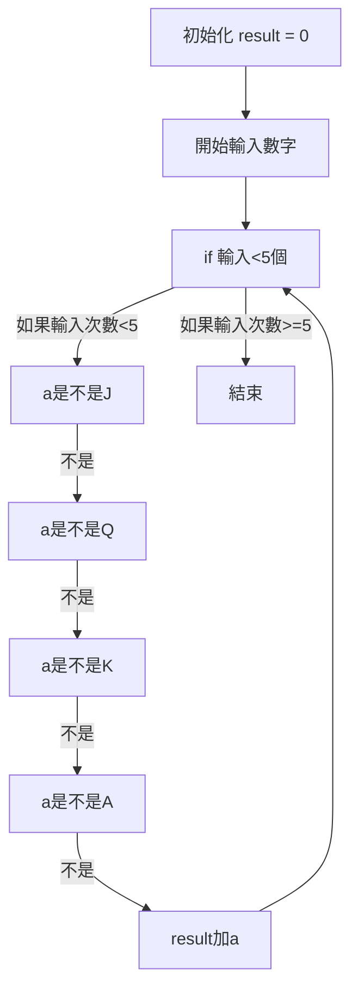

# 602 撲克牌總和
請撰寫一程式，讓使用者輸入52張牌中的5張，計算並輸出其總和。



```python

result = 0
for i in range(5):
  a = input()
  if (a == 'J'): result += 11
  elif(a == 'Q'): result += 12
  elif(a == 'K'): result += 13
  elif(a == 'A'): result += 1
  elif(int(a)<11):
    result += int(a)
print(result)

```