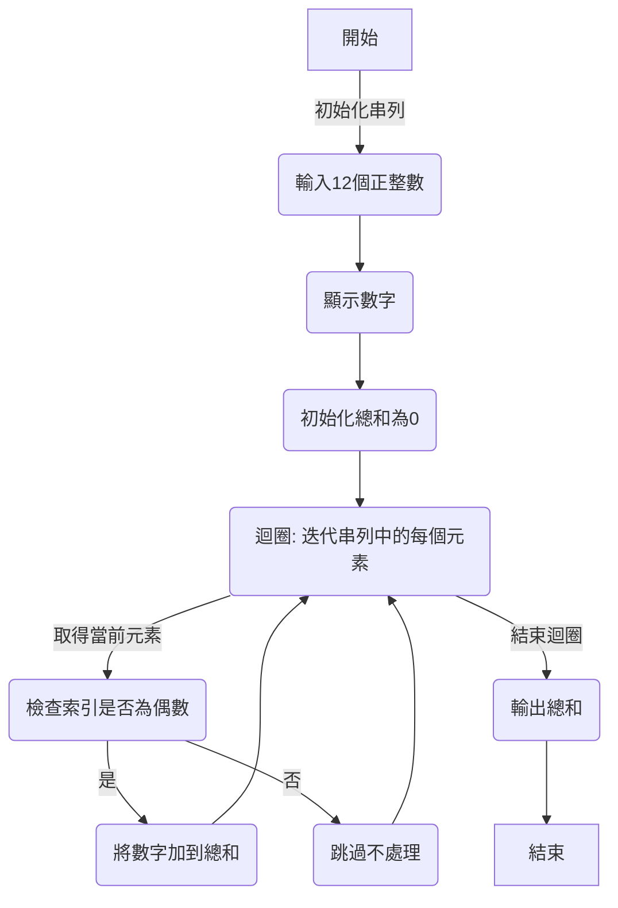

# 601

```mermaid
graph TD
    A[開始] -->|初始化串列| B(輸入12個正整數)
    B --> C(顯示數字)
    C --> D(初始化總和為0)
    D --> E(迴圈: 迭代串列中的每個元素)
    E -->|取得當前元素| F(檢查索引是否為偶數)
    F -->|是| G(將數字加到總和)
    F -->|否| H(跳過不處理)
    G --> E
    H --> E
    E -->|結束迴圈| I(輸出總和)
    I --> J[結束]
```