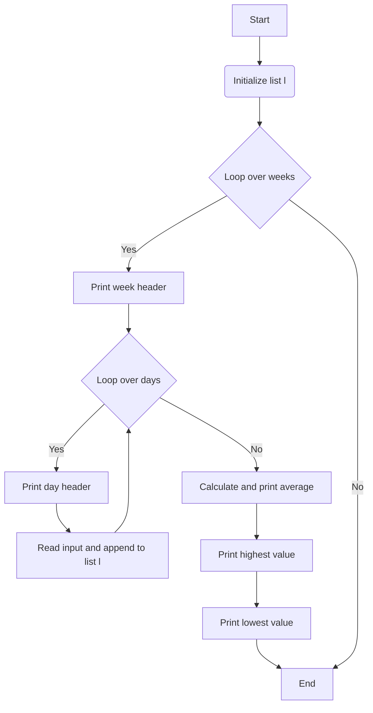

```mermaid
graph TD
  A[Start] --> B(Initialize list l)
  B --> C{Loop over weeks}
  C -->|Yes| D[Print week header]
  D --> E{Loop over days}
  E -->|Yes| F[Print day header]
  F --> G[Read input and append to list l]
  G --> E
  E -->|No| H[Calculate and print average]
  H --> I[Print highest value]
  I --> J[Print lowest value]
  J --> K[End]
  C -->|No| K
```