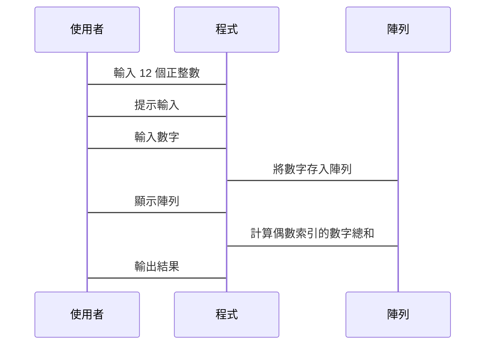

# 601

```mermaid
sequenceDiagram

    participant 使用者
    participant 程式

    使用者 -> 程式: 輸入 12 個正整數
    程式 -> 使用者: 提示輸入
    使用者 -> 程式: 輸入數字
    程式 -> 陣列: 將數字存入陣列
    程式 -> 使用者: 顯示陣列
    程式 -> 陣列: 計算偶數索引的數字總和
    程式 -> 使用者: 輸出結果

```
