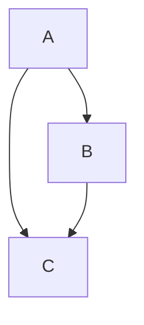
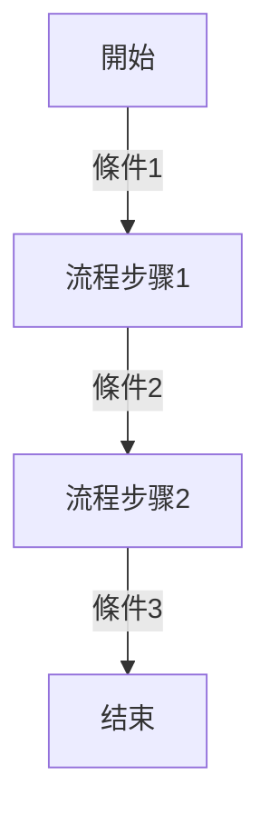
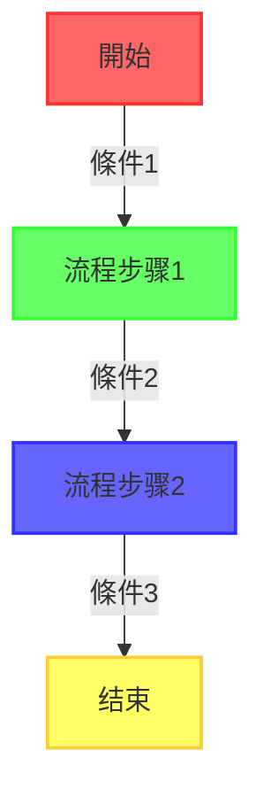

```mermaid
graph TD
  A[開始] -->|條件1| B[流程步骤1]
  B -->|條件2| C[流程步骤2]
  C -->|條件3| D[结束]
  style A width:150px, height:80px
  style B width:150px, height:80px
  style C width:150px, height:80px
  style D width:150px, height:80px
  ```

  ```mermaid
  graph TB
  A[開始] -->|條件1| B[流程步骤1]
  B -->|條件2| C[流程步骤2]
  C -->|條件3| D[结束]
  ```
