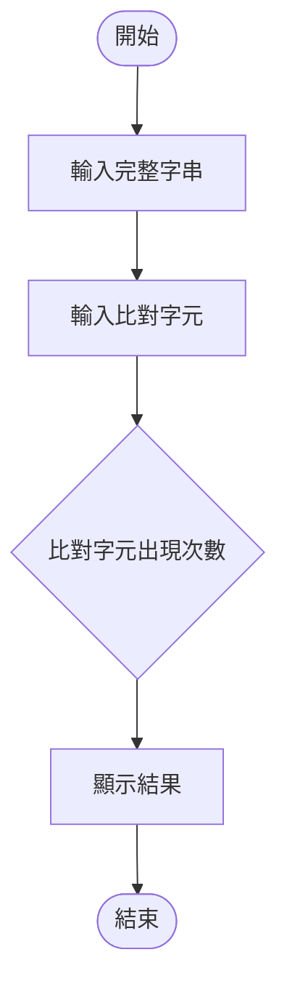
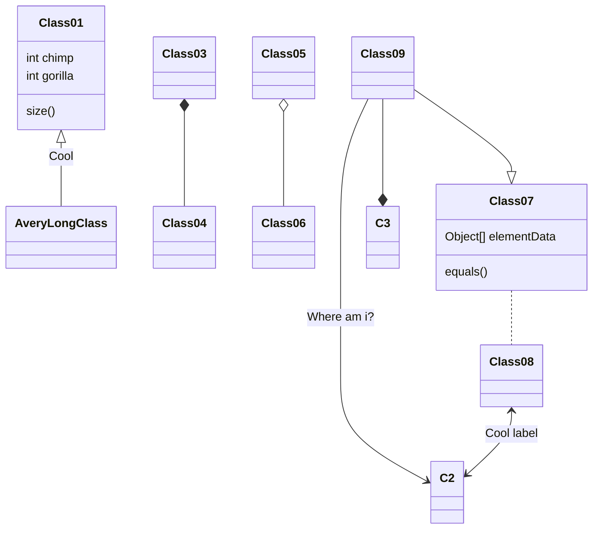
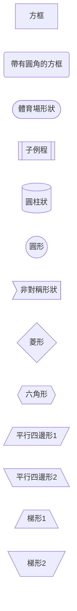

```mermaid
graph TD;
S([開始])--> 
A[輸入完整字串] --> 
B[輸入比對字元] -->
C{比對字元出現次數} -->
D:比對結束[顯示結果] -->
E([結束])
```

```mermaid
classDiagram
Class01 <|-- AveryLongClass : Cool
Class03 *-- Class04
Class05 o-- Class06
Class07 .. Class08
Class09 --> C2 : Where am i?
Class09 --* C3
Class09 --|> Class07
Class07 : equals()
Class07 : Object[] elementData
Class01 : size()
Class01 : int chimp
Class01 : int gorilla
Class08 <--> C2: Cool label
```

```mermaid
graph TD;
A --> B;
A --> C;
B --> D;
C --> D;
```

```mermaid
classDiagram
Class01 <|-- AveryLongClass : Cool
Class03 *-- Class04
Class05 o-- Class06
Class07 .. Class08
Class09 --> C2 : Where am i?
Class09 --* C3
Class09 --|> Class07
Class07 : equals()
Class07 : Object[] elementData
Class01 : size()
Class01 : int chimp
Class01 : int gorilla
Class08 <--> C2: Cool label
```

```mermaid
graph LR
  id1[方框]
  id2(帶有圓角的方框)
  id3([體育場形狀])
  id4[[子例程]]
  id5[(圓柱狀)]
  id6((圓形))
  id7>非對稱形狀]
  id8{菱形}
  id9{{六角形}}
  id10[/平行四邊形1/]
  id11[\平行四邊形2\]
  id12[/梯形1\]
  id13[\梯形2/]
```

